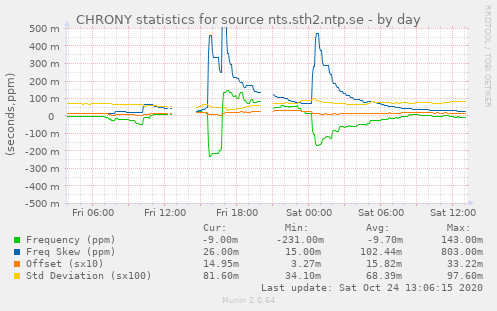
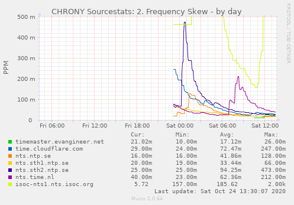

# Munin Plugins

A few munin plugins.

## chrony_

A wildcard plugin to present the behavior (from chronyc sourcestats) of a single time source.

## chrony_sourcestats

A multigraph plugin that will create 4 graphs representing offset, stdev, freq, and frequency skew respectively allowing to compare different time sources.

